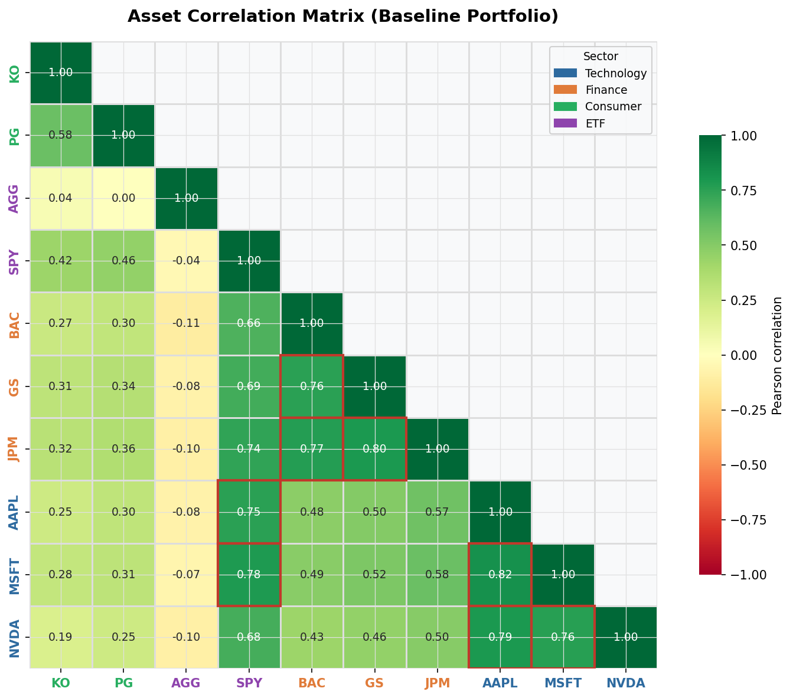
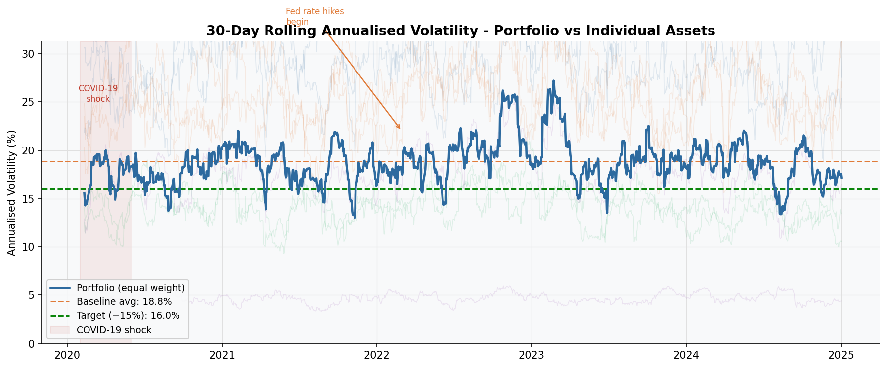
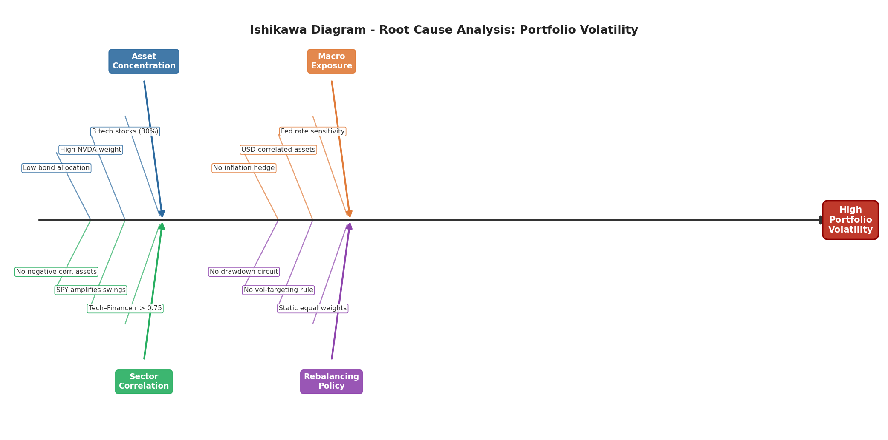
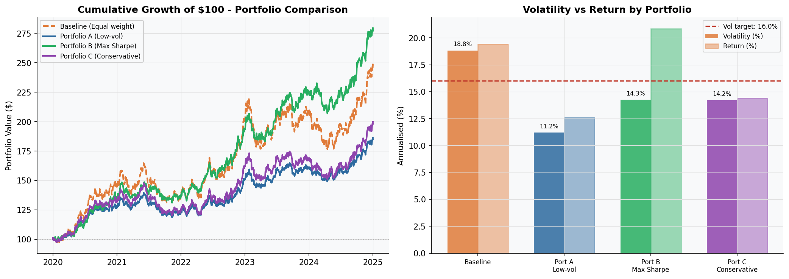
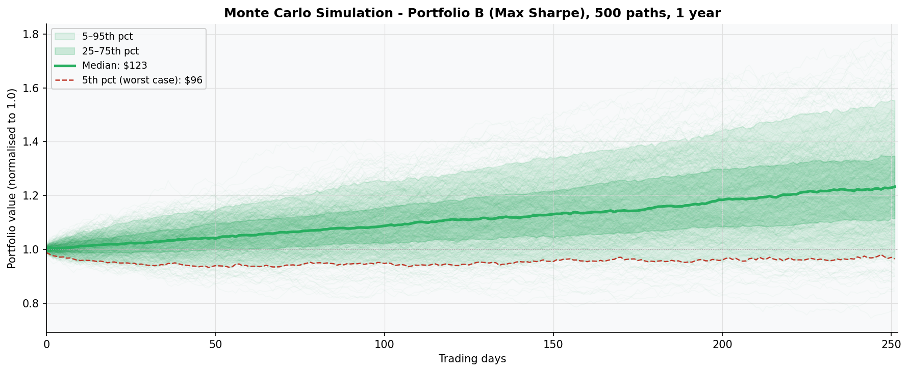

# Portfolio Risk Analysis - DMAIC Project
## Project Brief
This project simulates a real-world brief for a mid-size investment fund seeking to reduce portfolio volatility by 15% without sacrificing more than 5% of annual return. Taking the role of an aspiring business analyst, I applied the DMAIC methodology from my Lean Six Sigma Yellow Belt to structure the investigation. Starting with a portfolio of 10 assets across four sectors, I established baseline KPIs: annualised return, annualised volatility, Sharpe ratio, and maximum drawdown. The project goes on to identify root causes of excess volatility, model three alternative portfolio configurations, and recommend an optimised weight allocation that meets both targets.
## Methodology
The DMAIC (Define, Measure, Analyse, Improve, Control) framework is a structured methodology used to investigate and resolve underperforming business processes through clearly defined stages. It aligns directly with this project's objective (reducing portfolio volatility by 15% without sacrificing more than 5% of annual return) by ensuring the problem is properly measured before conclusions are drawn, root causes are identified before solutions are proposed, and improvements are validated against defined targets before a recommendation is made.
## DEFINE
### Problem Statement
The current equal-weight portfolio of 10 assets is generating an annualised 
volatility of 21.49%, which exceeds acceptable risk thresholds for the fund.
### Goal Statement
Reduce annualised portfolio volatility by 15% without sacrificing more than 
5% of annual return, while maintaining or improving the Sharpe ratio.
### Scope
 Assets:AAPL  Technology      
        AGG         ETF              
        BAC     Finance              
        GS     Finance             
        JPM     Finance            
        KO    Consumer            
        MSFT  Technology          
        NVDA  Technology               
        PG    Consumer             
        SPY         ETF              
 Time period: 01.01.2020 to 01.01.2025
 Methodology: DMAIC (Define, Measure, Analyse, Improve, Control) 
### KPI Targets
| KPI | Target |
|-----|--------|
| Annualised Volatility | Reduce by 15% |
| Annualised Return | Decrease by no more than 5% |
| Sharpe Ratio | Maintain or improve |
| Max Drawdown | Reduce |
### Stakeholder
A mid-size investment fund seeking to reduce their annualised volatility by 15% while not losing more than 5% of their annualised returns
## MEASURE - Baseline KPIs
| KPI | Baseline Value | Interpretation |
|-----|---------------|----------------|
| Annualised Return | 22.32% | Portfolio grew 22.32% per year on average |
| Annualised Volatility | 21.49% | Significant day-to-day fluctuation in returns |
| Sharpe Ratio | 1.04 | Acceptable but inefficient return per unit of risk |
| Max Drawdown | -32.07% | At its worst, the portfolio dropped 32.07% from its previous high |
## ANALYSE
### Chart 1 - Correlation Heatmap

The correlation heatmap displays the Pearson correlation coefficient between each pair of assets in the portfolio. Values range from -1 to +1, where assets closest to +1 tend to move in the same direction simultaneously. The analysis reveals strong positive correlation within sector clusters. Notable examples include AAPL and NVDA (0.79), JPM and GS (0.80), and MSFT and NVDA (0.76). In contrast, AGG demonstrates near-zero or negative correlation with every other asset in the portfolio. From a risk perspective, high intra-sector correlation means the portfolio is prone to large simultaneous drawdowns during market shocks. Increasing the allocation to AGG and reducing concentration in correlated tech and finance assets is a clear lever for achieving the 15% volatility reduction target.
### Chart 2 - Rolling Volatility

The 30-day rolling volatility chart displays the annualised volatility of the equal-weight portfolio at every point across the 5-year observation period, calculated using a sliding 30-day window. Two notable spikes are visible: the COVID-19 shock in early 2020, and a sustained period of elevated volatility in late 2022 and early 2023 coinciding with the Federal Reserve's aggressive interest rate hiking cycle, which created significant uncertainty across equity markets. Most critically, the portfolio's rolling volatility spends the vast majority of the period above the 16.0% target line, only briefly dipping below it during calmer market conditions. This confirms that equal weighting is insufficient to meet the volatility reduction target of 15% and reinforces the need for portfolio reoptimisation.
### Chart 3 - Ishikawa Diagram

The Ishikawa diagram identifies the root causes driving high portfolio volatility across four categories. The first is asset concentration - three technology stocks (AAPL, MSFT, NVDA) occupy a significant combined weight in the portfolio, and as demonstrated in the correlation heatmap, two of them share a correlation of 0.79. This concentration means a downturn in the technology sector disproportionately impacts the entire portfolio. The second root cause is a lack of rebalancing - with static equal weights applied throughout the 5-year period, no mechanism exists to reduce exposure to assets that have grown disproportionately volatile over time. The third cause is sector correlation - as identified in the heatmap, technology and finance assets are closely correlated, SPY amplifies market-wide swings rather than providing diversification, and AGG, the only asset with near-zero correlation, carries insufficient weight to meaningfully offset risk. Finally, macroeconomic sensitivity - the majority of assets are US-market-based equities, making the portfolio highly vulnerable to simultaneous drawdowns during macro shocks such as the Federal Reserve's 2022 rate hiking cycle.
## IMPROVE

The Improve stage addresses the root causes identified during the Analyse phase by modelling three alternative portfolio configurations. Portfolio A (low volatility) achieved the lowest annualised volatility of 11.19% but reduced annual return by 6.78%, breaching the maximum acceptable return loss of 5%. Portfolio C (conservative), manually reweighted based on insights from the Analyse stage, achieved the target volatility but reduced annual return by 25.9%, far exceeding the acceptable threshold. Portfolio B (Max Sharpe) is the clear recommendation, reducing annualised volatility from 18.83% to 14.26% (a relative reduction of 24.3%, exceeding the 15% target) while simultaneously increasing annual return by 7.5% against the baseline, meeting both project targets. Additionally, Portfolio B achieves the lowest max drawdown of all configurations at -11.78%, compared to the baseline of -20.66%, further demonstrating its superiority in managing downside risk. The Monte Carlo simulation further validates this recommendation by simulating 500 possible future years for Portfolio B based on its historical return and volatility profile. Even in the worst case scenario (bottom 5% of simulations), the portfolio experiences only a marginal decline in value. The median outcome projects a return of approximately 23% over the following year, demonstrating that the optimised portfolio is both robust under adverse conditions and strong under normal market conditions.
## CONTROL
The Control phase is necessary in order to ensure the trend of reduced volatility and increased annualised return continues. Chart 6 uses data from the control period (annualised volatility over a 21-day rolling period, as well as annualised return) to allow monitoring. The four key KPIs taken from the Measure phase are represented as RAG (Red, Amber, Green) indicators, with green indicating no action is needed, amber meaning close monitoring should be enforced, and red requiring immediate review and change. This dashboard prototype will be finalised in Power BI for a readable, clean deliverable.
## Conclusion
This project simulated a real-world portfolio optimisation engagement using the DMAIC framework. During the Analyse stage, key root causes of excess volatility were identified, including high intra-sector correlation between technology and finance assets, and a lack of rebalancing policy. These findings directly informed the Improve stage, where three alternative portfolio configurations were modelled and evaluated against the project targets. Portfolio B (Max Sharpe optimisation) was recommended as the optimal solution, successfully reducing annualised volatility by 24.3% while simultaneously increasing annualised return by 7.47% against the baseline, meeting both targets. This project demonstrates how a structured analytical framework can drive meaningful, data-backed investment decisions.
## Technologies Used
- Python (pandas, NumPy, matplotlib, seaborn, scipy, yfinance)
- Excel
- Power BI
## Disclaimer
This project is a simulated brief using real market data for educational 
purposes only and it does not constitute financial advice.